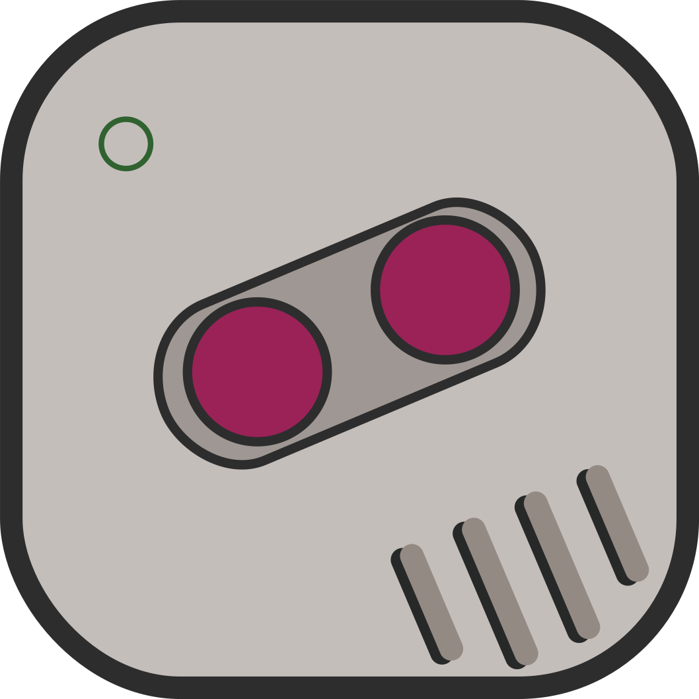

<picture>
  <source media="(prefers-color-scheme: dark)" srcset="./.github/assets/logo.svg">
  
</picture>

### `gbCEmu` | Game Boy™ C Emulator

<!---->

✨ Learning by doing: Exploring the fundamentals of emulation with a minimalist Game Boy™ project. 🎮

  <a href="https://github.com/SOHNE/gbCEmu/releases">
    Download
  </a>
  •
  <a href="#">
    Live Demo
  </a>
  •
  <a href="#">
    Project Notes 🇧🇷
  </a>

## Introduction

`gbCEmu`—a raw dive into retro computing. This Game Boy™ emulator, built in `C99`, isn’t about bells or whistles. It’s a hands-on experiment pieced together from a patchwork of online insights, designed to reveal the bare mechanics behind this classic handheld. Here, every line of code tries to be a lesson in minimalism, without unnecessary clutter.

> _**This project** serves as my experimental platform to delve into emulation's core principles. As a personal endeavor aimed at hands-on learning, it doesn't fully mirror the original hardware's intricacies. I welcome any contributions or suggestions. Feel free to explore the code, report issues, or submit pull requests._

> ⚠️ _This repository does not include nor endorse the use of illegal ROMs. Users are responsible for ensuring they have the legal right to use ~any~ ROMs with this software._ ⚠️ 

 Screenshots

  

## Usage

## Development

## Resources

## Contributing

## License

---

